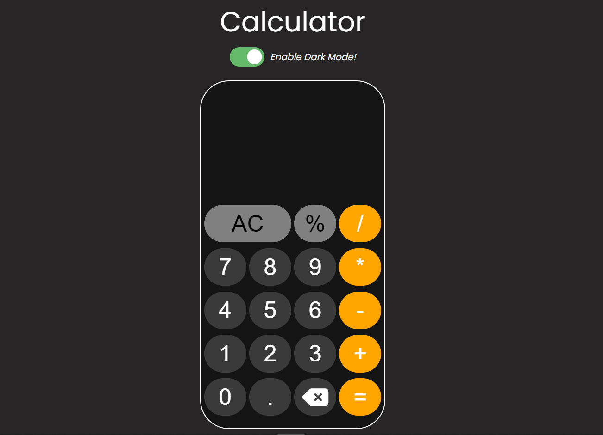

# Mini Web Calculator

## Welcome! 👋

Thanks for checking out this front-end coding challenge.

**To do this challenge, you need a basic understanding of HTML, CSS and JavaScript.**

## The challenge

This project is to build out this Mini Web Calculator and get it looking as close to the design as possible.

You can use any tools you like to help you complete the challenge. So if you've got something you'd like to practice, feel free to give it a go.

Your users should be able to:

- View the optimal layout for the app depending on their device's screen size.
- Switch between dark and light mode.
- Calculate any mathematical experssion.
- Clear the output screen on hitting AC button.

## Where to find everything

Your task is to build out the project to the designs inside the `/design` folder. You will find both a mobile and a desktop version of the design.

The designs are in PNG static format. Using PNGs will mean that you'll need to use your best judgment for styles such as `font-size`, `padding` and `margin`.

There is also a `style-guide.md` file containing the information you'll need, such as color palette and fonts.

**Have fun building!** 🚀
